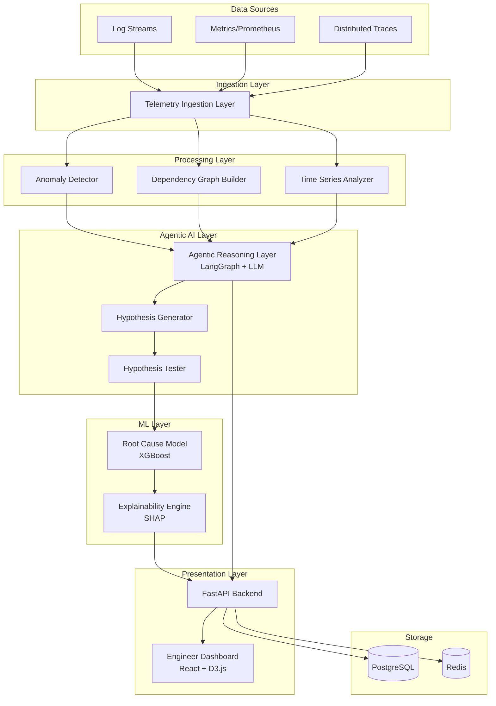

# Design Document: Explainable Incident Commander AI

## Overview

The Explainable Incident Commander AI is an autonomous SRE assistant built on an agentic architecture that investigates production incidents, identifies root causes, and explains its reasoning using explainable AI techniques. The system operates as a read-only investigator, never performing automated remediation.

### Key Design Principles

1. **Transparency First**: Every decision must be explainable with quantified reasoning
2. **Safety by Design**: No automated remediation - investigation and explanation only
3. **Agentic Autonomy**: LLM-powered reasoning layer orchestrates adaptive investigation workflows
4. **Multi-Signal Correlation**: Combine logs, metrics, traces, and topology for holistic analysis
5. **Human-in-the-Loop**: Present findings for human validation and action

### Technology Stack

- **Agentic Framework**: LangGraph for stateful multi-agent workflows
- **LLM**: OpenAI GPT-4 or Google Gemini for reasoning and natural language generation
- **ML Framework**: XGBoost for root cause classification
- **Explainability**: SHAP (SHapley Additive exPlanations) for feature attribution
- **Graph Processing**: NetworkX for dependency graph analysis
- **Backend API**: FastAPI with async support
- **Data Storage**: PostgreSQL for incident history, Redis for real-time state
- **Visualization**: React frontend with D3.js for graphs, Mermaid for timelines
- **Containerization**: Docker with docker-compose for local development

## Architecture

### High-Level Architecture



### Component Interaction Flow

1. **Telemetry Ingestion**: Continuous collection of logs, metrics, and traces
2. **Anomaly Detection**: Statistical analysis identifies deviations from baseline
3. **Graph Construction**: Traces are analyzed to build service dependency graph
4. **Incident Trigger**: Anomalies trigger the agentic reasoning workflow
5. **Hypothesis Generation**: Agent generates multiple root cause hypotheses
6. **Hypothesis Testing**: Each hypothesis is validated against telemetry data
7. **ML Prediction**: Root cause model predicts most likely culprit service
8. **Explanation Generation**: SHAP explains feature contributions to prediction
9. **Timeline Construction**: Events are ordered chronologically
10. **Presentation**: Dashboard displays findings with interactive visualizations

## Components and Interfaces

### 1. Telemetry Ingestion Layer

**Responsibility**: Collect and normalize telemetry data from multiple sources

**Interface**:
```python
class TelemetryIngestionLayer:
    def ingest_logs(self, service_id: str, log_entries: List[LogEntry]) -> None:
        """Ingest log entries from a service"""
        
    def ingest_metrics(self, service_id: str, metrics: MetricsSnapshot) -> None:
        """Ingest metrics snapshot (CPU, memory, latency, errors)"""
        
    def ingest_traces(self, trace: DistributedTrace) -> None:
        """Ingest distributed trace spanning multiple services"""
        
    def get_telemetry_window(
        self, 
        service_id: str, 
        start_time: datetime, 
        end_time: datetime
    ) -> TelemetryWindow:
        """Retrieve all telemetry for a service in a time window"""
```

**Data Models**:
```python
@dataclass
class LogEntry:
    timestamp: datetime
    service_id: str
    level: str  # ERROR, WARN, INFO, DEBUG
    message: str
    trace_id: Optional[str]

@dataclass
class MetricsSnapshot:
    timestamp: datetime
    service_id: str
    cpu_percent: float
    memory_mb: float
    request_rate: float
    error_rate: float
    p50_latency_ms: float
    p95_latency_ms: float
    p99_latency_ms: float

@dataclass
class DistributedTrace:
    trace_id: str
    root_span: Span
    spans: List[Span]
    
@dataclass
class Span:
    span_id: str
    parent_span_id: Optional[str]
    service_id: str
    operation: str
    start_time: datetime
    duration_ms: float
    status: str  # OK, ERROR
```

**Implementation Notes**:
- Use async I/O for high-throughput ingestion
- Buffer incoming data in Redis for real-time processing
- Persist to PostgreSQL for historical analysis
- Support both push (webhook) and pull (polling) ingestion modes

### 2. Anomaly Detector

**Responsibility**: Identify statistical anomalies in telemetry data

**Interface**:
```python
class AnomalyDetector:
    def detect_anomalies(
        self, 
        service_id: str, 
        window: TelemetryWindow
    ) -> List[Anomaly]:
        """Detect anomalies in a telemetry window"""
        
    def update_baseline(self, service_id: str, historical_data: TelemetryWindow) -> None:
        """Update baseline statistics for a service"""
        
    def get_baseline(self, service_id: str) -> BaselineStats:
        """Get current baseline statistics"""

@dataclass
class Anomaly:
    service_id: str
    timestamp: datetime
    anomaly_type: str  # CPU_SPIKE, MEMORY_SPIKE, LATENCY_SPIKE, ERROR_RATE_SPIKE
    severity: float  # 0.0 to 1.0
    observed_value: float
    baseline_value: float
    deviation_sigma: float  # Standard deviations from baseline
```

**Algorithm**:
- Use rolling window statistics (mean, std dev) for baseline
- Detect anomalies using z-score: `|value - mean| / std_dev > threshold`
- Default threshold: 3 sigma for high confidence
- Separate baselines for different time-of-day patterns (weekday vs weekend)

### 3. Dependency Graph Builder

**Responsibility**: Construct and maintain service dependency graph from traces

**Interface**:
```python
class DependencyGraphBuilder:
    def build_graph(self, traces: List[DistributedTrace]) -> DependencyGraph:
        """Build dependency graph from distributed traces"""
        
    def update_graph(self, trace: DistributedTrace) -> None:
        """Incrementally update graph with new trace"""
        
    def get_graph(self) -> DependencyGraph:
        """Get current dependency graph"""
        
    def get_upstream_services(self, service_id: str) -> List[str]:
        """Get services that call this service"""
        
    def get_downstream_services(self, service_id: str) -> List[str]:
        """Get services called by this service"""
        
    def calculate_blast_radius(self, service_id: str) -> Set[str]:
        """Calculate all services affected if this service fails"""

class DependencyGraph:
    def __init__(self):
        self.graph = nx.DiGraph()  # NetworkX directed graph
        
    def add_edge(self, from_service: str, to_service: str, weight: int = 1) -> None:
        """Add or update edge (weight = call frequency)"""
        
    def get_shortest_path(self, from_service: str, to_service: str) -> List[str]:
        """Find shortest dependency path between services"""
        
    def to_json(self) -> dict:
        """Serialize graph for visualization"""
```

**Implementation Notes**:
- Use NetworkX DiGraph for efficient graph operations
- Edge weights represent call frequency (for prioritization)
- Blast radius calculated via BFS traversal of downstream nodes
- Graph persisted to PostgreSQL, cached in Redis for fast access

### 4. Agentic Reasoning Layer

**Responsibility**: Orchestrate investigation workflow using LLM-powered reasoning

**Interface**:
```python
class AgenticReasoningLayer:
    def __init__(self, llm_client: LLMClient):
        self.llm = llm_client
        self.workflow = self._build_langgraph_workflow()
        
    def investigate_incident(
        self, 
        anomalies: List[Anomaly], 
        graph: DependencyGraph,
        telemetry: Dict[str, TelemetryWindow]
    ) -> IncidentReport:
        """Execute full investigation workflow"""
        
    def generate_hypotheses(
        self, 
        anomalies: List[Anomaly], 
        graph: DependencyGraph
    ) -> List[Hypothesis]:
        """Generate root cause hypotheses"""
        
    def test_hypothesis(
        self, 
        hypothesis: Hypothesis, 
        telemetry: Dict[str, TelemetryWindow]
    ) -> HypothesisTestResult:
        """Test a hypothesis against telemetry data"""
        
    def rank_hypotheses(
        self, 
        test_results: List[HypothesisTestResult]
    ) -> List[RankedHypothesis]:
        """Rank hypotheses by likelihood"""

@dataclass
class Hypothesis:
    hypothesis_id: str
    root_cause_service: str
    failure_type: str  # RESOURCE_EXHAUSTION, DOWNSTREAM_FAILURE, DEPLOYMENT_ISSUE
    reasoning: str  # Natural language explanation
    supporting_evidence: List[str]
    
@dataclass
class HypothesisTestResult:
    hypothesis: Hypothesis
    temporal_consistency: bool  # Events in correct order
    correlation_score: float  # 0.0 to 1.0
    evidence_strength: float  # 0.0 to 1.0
    
@dataclass
class RankedHypothesis:
    hypothesis: Hypothesis
    likelihood_score: float  # 0.0 to 1.0
    rank: int
```

**LangGraph Workflow**:
```python
def _build_langgraph_workflow(self) -> StateGraph:
    workflow = StateGraph(InvestigationState)
    
    # Define nodes (investigation steps)
    workflow.add_node("collect_signals", self._collect_signals)
    workflow.add_node("generate_hypotheses", self._generate_hypotheses_node)
    workflow.add_node("test_hypotheses", self._test_hypotheses_node)
    workflow.add_node("rank_hypotheses", self._rank_hypotheses_node)
    workflow.add_node("explain_decision", self._explain_decision_node)
    
    # Define edges (workflow transitions)
    workflow.add_edge("collect_signals", "generate_hypotheses")
    workflow.add_edge("generate_hypotheses", "test_hypotheses")
    workflow.add_edge("test_hypotheses", "rank_hypotheses")
    workflow.add_edge("rank_hypotheses", "explain_decision")
    
    workflow.set_entry_point("collect_signals")
    workflow.set_finish_point("explain_decision")
    
    return workflow.compile()

@dataclass
class InvestigationState:
    anomalies: List[Anomaly]
    dependency_graph: DependencyGraph
    telemetry: Dict[str, TelemetryWindow]
    hypotheses: List[Hypothesis]
    test_results: List[HypothesisTestResult]
    ranked_hypotheses: List[RankedHypothesis]
    final_report: Optional[IncidentReport]
```

**LLM Prompting Strategy**:
- Use structured prompts with few-shot examples for hypothesis generation
- Provide context: anomalies, dependency graph, recent deployments
- Request JSON-formatted output for structured parsing
- Use chain-of-thought prompting for reasoning transparency

### 5. Root Cause Model

**Responsibility**: ML-based prediction of root cause service

**Interface**:
```python
class RootCauseModel:
    def __init__(self):
        self.model = xgboost.XGBClassifier()
        self.feature_extractor = FeatureExtractor()
        
    def predict(
        self, 
        candidate_services: List[str],
        anomalies: List[Anomaly],
        graph: DependencyGraph,
        telemetry: Dict[str, TelemetryWindow]
    ) -> RootCausePrediction:
        """Predict root cause service with probability distribution"""
        
    def train(self, training_data: List[LabeledIncident]) -> None:
        """Train model on historical incident data"""
        
    def extract_features(
        self, 
        service_id: str,
        anomalies: List[Anomaly],
        graph: DependencyGraph,
        telemetry: TelemetryWindow
    ) -> FeatureVector:
        """Extract features for a candidate service"""

@dataclass
class FeatureVector:
    service_id: str
    cpu_spike_magnitude: float  # Deviation from baseline
    memory_spike_magnitude: float
    latency_spike_magnitude: float
    error_rate_spike_magnitude: float
    downstream_failure_count: int
    upstream_failure_count: int
    recent_deployment: bool  # Within last 1 hour
    call_frequency: int  # How often this service is called
    blast_radius_size: int
    
@dataclass
class RootCausePrediction:
    predicted_service: str
    probability: float
    probability_distribution: Dict[str, float]  # All candidates with probabilities
```

**Feature Engineering**:
- **Spike Magnitudes**: Z-score of current value vs baseline
- **Failure Counts**: Number of downstream/upstream services with anomalies
- **Deployment Flag**: Binary indicator of recent deployment
- **Call Frequency**: Edge weight in dependency graph
- **Blast Radius**: Number of downstream services

**Model Training**:
- Use XGBoost for interpretability and performance
- Train on historical incidents with labeled root causes
- Handle class imbalance with SMOTE or class weights
- Cross-validate with time-series split (no data leakage)

### 6. Explainability Engine

**Responsibility**: Generate human-readable explanations using SHAP

**Interface**:
```python
class ExplainabilityEngine:
    def __init__(self, model: RootCauseModel):
        self.model = model
        self.explainer = shap.TreeExplainer(model.model)
        
    def explain_prediction(
        self, 
        prediction: RootCausePrediction,
        feature_vector: FeatureVector
    ) -> Explanation:
        """Generate SHAP explanation for prediction"""
        
    def get_feature_contributions(
        self, 
        feature_vector: FeatureVector
    ) -> List[FeatureContribution]:
        """Get ranked feature contributions"""

@dataclass
class FeatureContribution:
    feature_name: str
    contribution_percent: float  # Percentage contribution to prediction
    feature_value: float
    baseline_value: float
    direction: str  # POSITIVE (supports prediction) or NEGATIVE (argues against)
    
@dataclass
class Explanation:
    predicted_service: str
    feature_contributions: List[FeatureContribution]
    natural_language_summary: str
    shap_values: np.ndarray
```

**SHAP Integration**:
- Use TreeExplainer for XGBoost (fast and exact)
- Calculate SHAP values for the predicted class
- Normalize to percentages for intuitive understanding
- Generate natural language summary using LLM with SHAP values as context

**Explanation Template**:
```
Service X is identified as the root cause with 87% confidence.

Key contributing factors:
1. CPU Spike (35%): CPU usage spiked to 95% (baseline: 40%)
2. Downstream Failures (28%): 4 downstream services failed after this service
3. Recent Deployment (22%): Deployment occurred 15 minutes before incident
4. Error Rate Spike (15%): Error rate increased to 12% (baseline: 0.5%)
```

### 7. Incident Timeline Builder

**Responsibility**: Construct chronological timeline of incident events

**Interface**:
```python
class IncidentTimelineBuilder:
    def build_timeline(
        self, 
        anomalies: List[Anomaly],
        deployments: List[Deployment],
        hypothesis: Hypothesis
    ) -> IncidentTimeline:
        """Build chronological timeline of events"""
        
    def add_causal_annotations(
        self, 
        timeline: IncidentTimeline,
        hypothesis: Hypothesis
    ) -> IncidentTimeline:
        """Annotate timeline with causal relationships"""

@dataclass
class TimelineEvent:
    timestamp: datetime
    event_type: str  # ANOMALY, DEPLOYMENT, FAILURE
    service_id: str
    description: str
    severity: Optional[float]
    
@dataclass
class IncidentTimeline:
    events: List[TimelineEvent]  # Sorted by timestamp
    causal_chains: List[CausalChain]
    
@dataclass
class CausalChain:
    cause_event: TimelineEvent
    effect_events: List[TimelineEvent]
    reasoning: str
```

### 8. FastAPI Backend

**Responsibility**: REST API for triggering investigations and retrieving results

**Endpoints**:
```python
@app.post("/api/v1/incidents/investigate")
async def trigger_investigation(request: InvestigationRequest) -> InvestigationResponse:
    """Trigger incident investigation"""
    
@app.get("/api/v1/incidents/{incident_id}")
async def get_incident(incident_id: str) -> IncidentReport:
    """Retrieve incident report"""
    
@app.get("/api/v1/incidents")
async def list_incidents(
    start_time: Optional[datetime] = None,
    end_time: Optional[datetime] = None,
    service_id: Optional[str] = None
) -> List[IncidentSummary]:
    """List historical incidents with filters"""
    
@app.get("/api/v1/graph")
async def get_dependency_graph() -> DependencyGraphResponse:
    """Get current dependency graph"""
    
@app.post("/api/v1/telemetry/ingest")
async def ingest_telemetry(data: TelemetryBatch) -> IngestResponse:
    """Ingest telemetry data (for demo mode)"""
```

### 9. Engineer Dashboard

**Responsibility**: Interactive web UI for viewing incident analysis

**Components**:
- **Dependency Graph Visualizer**: D3.js force-directed graph with color-coded nodes
- **Timeline Viewer**: Horizontal timeline with event markers
- **Explanation Panel**: SHAP feature contribution bar chart
- **Hypothesis List**: Ranked list of alternative hypotheses
- **Incident Summary**: Natural language summary with key metrics

**Visualization Design**:
- Root cause service: Red node with pulsing border
- Propagated failures: Orange nodes
- Healthy services: Green nodes
- Edge thickness: Proportional to call frequency
- Timeline: Vertical line for each event, color-coded by severity

## Data Models

### Core Domain Models

```python
@dataclass
class IncidentReport:
    incident_id: str
    start_time: datetime
    end_time: datetime
    primary_root_cause: str
    confidence: float
    affected_services: List[str]
    blast_radius: Set[str]
    timeline: IncidentTimeline
    explanation: Explanation
    alternative_hypotheses: List[RankedHypothesis]
    dependency_graph_snapshot: DependencyGraph
    
@dataclass
class LabeledIncident:
    """Training data for root cause model"""
    incident_id: str
    features: Dict[str, FeatureVector]  # Per-service features
    true_root_cause: str
    incident_type: str
```

### Database Schema

**PostgreSQL Tables**:

```sql
-- Incidents table
CREATE TABLE incidents (
    incident_id UUID PRIMARY KEY,
    start_time TIMESTAMP NOT NULL,
    end_time TIMESTAMP,
    primary_root_cause VARCHAR(255),
    confidence FLOAT,
    report_json JSONB,
    created_at TIMESTAMP DEFAULT NOW()
);

-- Telemetry table (time-series data)
CREATE TABLE telemetry (
    id BIGSERIAL PRIMARY KEY,
    timestamp TIMESTAMP NOT NULL,
    service_id VARCHAR(255) NOT NULL,
    metric_type VARCHAR(50) NOT NULL,
    value FLOAT NOT NULL,
    INDEX idx_telemetry_service_time (service_id, timestamp)
);

-- Anomalies table
CREATE TABLE anomalies (
    id BIGSERIAL PRIMARY KEY,
    incident_id UUID REFERENCES incidents(incident_id),
    timestamp TIMESTAMP NOT NULL,
    service_id VARCHAR(255) NOT NULL,
    anomaly_type VARCHAR(50) NOT NULL,
    severity FLOAT,
    observed_value FLOAT,
    baseline_value FLOAT
);

-- Dependency graph snapshots
CREATE TABLE dependency_graphs (
    id BIGSERIAL PRIMARY KEY,
    incident_id UUID REFERENCES incidents(incident_id),
    snapshot_time TIMESTAMP NOT NULL,
    graph_json JSONB NOT NULL
);
```

**Redis Keys**:
- `telemetry:realtime:{service_id}`: Recent metrics (last 5 minutes)
- `graph:current`: Current dependency graph
- `baseline:{service_id}`: Baseline statistics per service
- `incident:active:{incident_id}`: Active investigation state


## Correctness Properties

*A property is a characteristic or behavior that should hold true across all valid executions of a system—essentially, a formal statement about what the system should do. Properties serve as the bridge between human-readable specifications and machine-verifiable correctness guarantees.*

### Property 1: Telemetry Ingestion Round-Trip

*For any* telemetry data (logs, metrics, or traces) ingested into the system, retrieving that data from storage should return equivalent data with all required fields preserved.

**Validates: Requirements 1.1, 1.2, 1.5**

### Property 2: Timestamp Precision Preservation

*For any* telemetry data point ingested, the stored timestamp should have millisecond precision (no loss of precision during ingestion and storage).

**Validates: Requirements 1.3**

### Property 3: Ingestion Resilience to Service Failures

*For any* set of services where a subset becomes unavailable, the Telemetry Ingestion Layer should continue collecting data from all available services without interruption.

**Validates: Requirements 1.4**

### Property 4: Anomaly Detection for Known Deviations

*For any* telemetry data where a metric (CPU, memory, latency, or error rate) exceeds its baseline by more than the configured threshold, the Anomaly Detector should flag an anomaly of the corresponding type.

**Validates: Requirements 2.1, 2.2, 2.3, 2.4**

### Property 5: Anomaly Record Completeness

*For any* detected anomaly, the anomaly record should contain all required fields: service_id, timestamp, anomaly_type, severity, observed_value, and baseline_value.

**Validates: Requirements 2.5**

### Property 6: Dependency Graph Edge Direction

*For any* distributed trace where service A calls service B, the constructed dependency graph should contain a directed edge from A to B (not B to A).

**Validates: Requirements 3.1, 3.2**

### Property 7: Upstream/Downstream Relationship Consistency

*For any* dependency graph, if service A has a directed edge to service B, then A should appear in B's upstream services list and B should appear in A's downstream services list.

**Validates: Requirements 3.3**

### Property 8: Blast Radius Calculation

*For any* service in the dependency graph, the calculated blast radius should include all services reachable by traversing downstream edges (transitive closure of downstream dependencies).

**Validates: Requirements 3.4**

### Property 9: Graph Update Idempotency

*For any* distributed trace, adding it to the dependency graph multiple times should produce the same graph as adding it once (no duplicate edges or nodes).

**Validates: Requirements 3.5**

### Property 10: Hypothesis Generation Completeness

*For any* set of anomalies across multiple services, the Agentic Reasoning Layer should generate at least one hypothesis per anomalous service.

**Validates: Requirements 4.1**

### Property 11: Hypothesis Structure Completeness

*For any* generated hypothesis, it should contain all required fields: root_cause_service, failure_type, reasoning, and supporting_evidence.

**Validates: Requirements 4.2**

### Property 12: Cascading Failure Hypothesis Generation

*For any* service with downstream failures in the dependency graph, the system should generate at least one hypothesis attributing the downstream failures to upstream propagation from that service.

**Validates: Requirements 4.3**

### Property 13: Deployment-Related Hypothesis Generation

*For any* service with a recent deployment (within the last hour) and observed anomalies, the system should generate at least one hypothesis linking the deployment to the anomalies.

**Validates: Requirements 4.4**

### Property 14: All Hypotheses Tested

*For any* set of generated hypotheses, the Agentic Reasoning Layer should test each hypothesis against available telemetry data (no hypothesis should be skipped).

**Validates: Requirements 5.1**

### Property 15: Temporal Consistency Verification

*For any* hypothesis proposing a causal chain, hypothesis testing should verify that the suspected root cause event occurred before the downstream failure events.

**Validates: Requirements 5.2**

### Property 16: Hypothesis Ranking by Score

*For any* set of tested hypotheses with likelihood scores, the ranked list should be ordered by descending likelihood score (highest score first).

**Validates: Requirements 5.4**

### Property 17: Highest-Ranked Hypothesis Selection

*For any* ranked list of hypotheses, the selected primary root cause should be the hypothesis with the highest likelihood score.

**Validates: Requirements 5.5**

### Property 18: Feature Vector Completeness

*For any* service being evaluated for root cause prediction, the extracted feature vector should contain all required features: cpu_spike_magnitude, memory_spike_magnitude, latency_spike_magnitude, error_rate_spike_magnitude, downstream_failure_count, upstream_failure_count, recent_deployment, call_frequency, and blast_radius_size.

**Validates: Requirements 6.1**

### Property 19: Probability Distribution Completeness

*For any* root cause prediction with multiple candidate services, the probability distribution should include a probability value for each candidate service.

**Validates: Requirements 6.2**

### Property 20: Highest Probability Service Selection

*For any* root cause prediction, the predicted service should be the service with the highest probability in the probability distribution.

**Validates: Requirements 6.3**

### Property 21: SHAP Explanation Generation

*For any* root cause prediction, the Explainability Engine should generate feature contribution scores for all features in the feature vector.

**Validates: Requirements 7.1, 7.2**

### Property 22: Feature Contribution Ranking

*For any* explanation, the feature contributions should be ranked by descending absolute contribution magnitude.

**Validates: Requirements 7.3**

### Property 23: Feature Contributions Sum to 100%

*For any* explanation, the sum of all feature contribution percentages should equal 100% (within floating-point tolerance of 0.01%).

**Validates: Requirements 7.4**

### Property 24: Negative Contribution Direction Marking

*For any* feature contribution with a negative SHAP value, the direction field should be marked as "NEGATIVE" (arguing against the prediction).

**Validates: Requirements 7.5**

### Property 25: Timeline Chronological Ordering

*For any* incident timeline, all events should be ordered chronologically by timestamp (earlier events appear before later events).

**Validates: Requirements 8.2**

### Property 26: Timeline Event Type Completeness

*For any* incident with detected anomalies, service failures, and deployments, the incident timeline should include events of all three types: ANOMALY, FAILURE, and DEPLOYMENT.

**Validates: Requirements 8.1, 8.3**

### Property 27: Timeline Event Description Presence

*For any* event in an incident timeline, the event should have a non-empty human-readable description.

**Validates: Requirements 8.5**

### Property 28: Incident Summary Completeness

*For any* completed incident investigation, the incident summary should contain all required fields: primary_root_cause, affected_services, blast_radius, timeline, explanation, and alternative_hypotheses.

**Validates: Requirements 9.1, 9.2, 9.3, 9.4**

### Property 29: No Automated Remediation Actions

*For any* incident investigation, the system should not invoke any functions that modify service state, including: restart_service, scale_resources, deploy_code, rollback_deployment, or modify_configuration.

**Validates: Requirements 11.1, 11.2, 11.3, 11.4**

### Property 30: Investigation Workflow Completeness

*For any* incident investigation, the Agentic Reasoning Layer should execute all workflow steps in order: signal collection, graph construction, hypothesis generation, hypothesis testing, and explanation generation.

**Validates: Requirements 12.1**

### Property 31: Sequential Workflow Execution

*For any* investigation workflow, each step should complete before the next step begins (no step should start while the previous step is still executing).

**Validates: Requirements 12.2**

### Property 32: Adaptive Hypothesis Generation

*For any* hypothesis testing phase where all hypotheses have likelihood scores below a threshold (e.g., 0.3), the system should generate at least one additional hypothesis.

**Validates: Requirements 12.3**

### Property 33: Severity-Based Investigation Prioritization

*For any* set of multiple simultaneous anomalies, the investigation should process anomalies in descending order of severity score.

**Validates: Requirements 12.4**

### Property 34: LLM Explanation Presence

*For any* completed investigation, the incident report should include a non-empty natural language explanation generated by the LLM.

**Validates: Requirements 12.5**

### Property 35: Incident Data Persistence Round-Trip

*For any* completed incident investigation, persisting the incident data and then retrieving it should return equivalent data with all fields preserved (incident summary, timeline, root cause analysis, hypotheses, and graph snapshot).

**Validates: Requirements 13.1, 13.2, 13.3**

### Property 36: Historical Incident Query Filtering

*For any* historical incident query with filters (time range, service_id, or root cause type), all returned incidents should match the specified filter criteria.

**Validates: Requirements 13.4**

### Property 37: API Authentication Enforcement

*For any* API request without a valid API key, the system should return HTTP 401 Unauthorized status and not process the request.

**Validates: Requirements 15.4**

### Property 38: API Response Format Validity

*For any* successful API response, the response body should be valid JSON and the HTTP status code should be in the 2xx range.

**Validates: Requirements 15.5**

## Error Handling

### Telemetry Ingestion Errors

**Missing Required Fields**:
- Reject telemetry data missing required fields (service_id, timestamp)
- Return HTTP 400 Bad Request with descriptive error message
- Log validation errors for debugging

**Invalid Timestamp Format**:
- Reject data with unparseable timestamps
- Return HTTP 400 with expected format specification
- Support ISO 8601 and Unix epoch formats

**Storage Failures**:
- Retry failed writes to PostgreSQL up to 3 times with exponential backoff
- Fall back to Redis-only storage if PostgreSQL is unavailable
- Alert on persistent storage failures

### Anomaly Detection Errors

**Insufficient Baseline Data**:
- Require minimum 24 hours of historical data before detecting anomalies
- Return empty anomaly list if baseline is insufficient
- Log warning about insufficient baseline

**Missing Telemetry Data**:
- Skip anomaly detection for services with no recent telemetry (>5 minutes)
- Do not flag missing data as an anomaly
- Log services with missing data

### Dependency Graph Errors

**Circular Dependencies**:
- Detect cycles in dependency graph using DFS
- Log warning about circular dependencies
- Continue processing (cycles are valid in microservices)

**Orphaned Services**:
- Include services with no edges in the graph
- Mark as isolated nodes in visualization
- Do not exclude from root cause analysis

### ML Model Errors

**Model Not Trained**:
- Return error if prediction is requested before model training
- Provide fallback: rank by anomaly severity only
- Log warning about missing model

**Feature Extraction Failures**:
- Use default values for missing features (0 for numeric, False for boolean)
- Log warning about missing features
- Continue with partial feature vector

**Prediction Confidence Too Low**:
- If highest probability < 0.3, flag as "uncertain"
- Present top 3 candidates instead of single prediction
- Recommend manual investigation

### LLM Errors

**API Rate Limiting**:
- Implement exponential backoff for rate limit errors
- Cache LLM responses for identical inputs
- Fall back to template-based explanations if LLM unavailable

**Invalid JSON Response**:
- Retry with explicit JSON format instruction
- Parse partial JSON if possible
- Fall back to unstructured text parsing

**Timeout**:
- Set 30-second timeout for LLM calls
- Retry once on timeout
- Use cached or template-based response on repeated timeout

### API Errors

**Invalid Request Format**:
- Validate request schema using Pydantic
- Return HTTP 400 with detailed validation errors
- Include example of valid request format

**Resource Not Found**:
- Return HTTP 404 for non-existent incident IDs
- Include suggestion to list available incidents
- Log access to non-existent resources

**Internal Server Errors**:
- Catch all unhandled exceptions
- Return HTTP 500 with generic error message (hide internal details)
- Log full stack trace for debugging
- Alert on repeated 500 errors

## Testing Strategy

### Dual Testing Approach

This system requires both **unit tests** and **property-based tests** for comprehensive coverage:

- **Unit tests**: Verify specific examples, edge cases, and error conditions
- **Property tests**: Verify universal properties across all inputs using randomized testing

Both approaches are complementary and necessary. Unit tests catch concrete bugs in specific scenarios, while property tests verify general correctness across a wide input space.

### Property-Based Testing Configuration

**Framework**: Use `hypothesis` library for Python

**Configuration**:
- Minimum 100 iterations per property test (due to randomization)
- Each property test must reference its design document property
- Tag format: `# Feature: explainable-incident-commander, Property {number}: {property_text}`

**Example Property Test**:
```python
from hypothesis import given, strategies as st
import hypothesis

@given(
    telemetry=st.builds(TelemetryData),
    service_id=st.text(min_size=1, max_size=50)
)
@hypothesis.settings(max_examples=100)
def test_telemetry_ingestion_round_trip(telemetry, service_id):
    """
    Feature: explainable-incident-commander
    Property 1: Telemetry Ingestion Round-Trip
    
    For any telemetry data ingested, retrieving it should return equivalent data.
    """
    # Ingest telemetry
    ingestion_layer.ingest_metrics(service_id, telemetry)
    
    # Retrieve telemetry
    retrieved = ingestion_layer.get_telemetry_window(
        service_id, 
        telemetry.timestamp, 
        telemetry.timestamp
    )
    
    # Verify equivalence
    assert retrieved.service_id == service_id
    assert retrieved.cpu_percent == telemetry.cpu_percent
    assert retrieved.memory_mb == telemetry.memory_mb
    # ... verify all fields
```

### Unit Testing Strategy

**Focus Areas**:
1. **Specific Examples**: Test known incident scenarios (e.g., CPU spike causing cascading failures)
2. **Edge Cases**: Empty graphs, single-node graphs, all services healthy
3. **Error Conditions**: Invalid input, missing data, model failures
4. **Integration Points**: API endpoints, database operations, LLM calls

**Example Unit Test**:
```python
def test_blast_radius_single_service():
    """Test blast radius calculation for a service with no downstream dependencies"""
    graph = DependencyGraph()
    graph.add_node("service-a")
    
    blast_radius = graph.calculate_blast_radius("service-a")
    
    assert blast_radius == {"service-a"}  # Only itself

def test_anomaly_detection_cpu_spike():
    """Test that CPU spike above threshold is detected"""
    detector = AnomalyDetector()
    detector.update_baseline("service-a", baseline_data)
    
    spike_data = create_telemetry_with_cpu_spike(cpu_percent=95.0)
    anomalies = detector.detect_anomalies("service-a", spike_data)
    
    assert len(anomalies) == 1
    assert anomalies[0].anomaly_type == "CPU_SPIKE"
    assert anomalies[0].severity > 0.8
```

### Integration Testing

**End-to-End Scenarios**:
1. **Demo Mode**: Run complete investigation on mock microservice outage
2. **API Workflow**: Ingest telemetry → trigger investigation → retrieve report
3. **Multi-Service Cascade**: Test incident propagating through 5+ services

**Test Environment**:
- Use Docker Compose to spin up full stack (API, PostgreSQL, Redis)
- Mock LLM responses for deterministic testing
- Use pre-trained model or mock model for consistent predictions

### Performance Testing

**Load Testing**:
- Ingest 10,000 telemetry data points per second
- Verify investigation completes within 30 seconds for 20-service graph
- Test concurrent investigations (5 simultaneous incidents)

**Query Performance**:
- Verify historical incident queries return within 2 seconds
- Test with 10,000+ historical incidents in database
- Verify graph retrieval scales to 100+ service nodes

### Mock Data Generation for Testing

**Realistic Incident Scenarios**:
1. **CPU Exhaustion**: Service A CPU spikes → downstream latency increases
2. **Memory Leak**: Service B memory grows → OOM → restarts → cascading failures
3. **Deployment Regression**: Service C deployed → error rate spikes immediately
4. **Database Overload**: Service D (database) slow → all callers experience latency
5. **Network Partition**: Service E unreachable → all callers get timeouts

**Mock Data Generators**:
```python
def generate_cpu_spike_scenario() -> IncidentScenario:
    """Generate realistic CPU spike incident with cascading effects"""
    # Create 5-service dependency chain
    # Inject CPU spike in root service
    # Propagate latency increases downstream
    # Add realistic timestamps with 1-minute progression
    
def generate_deployment_regression_scenario() -> IncidentScenario:
    """Generate deployment-related incident"""
    # Create deployment event
    # Inject error rate spike 2 minutes after deployment
    # Add realistic error logs
```

### Test Coverage Goals

- **Line Coverage**: >80% for core logic (ingestion, detection, graph, ML)
- **Branch Coverage**: >70% for error handling paths
- **Property Coverage**: 100% of design properties implemented as tests
- **Integration Coverage**: All API endpoints tested end-to-end

