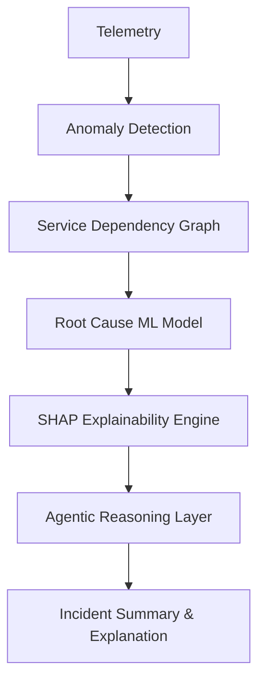

# Explainable Incident Commander AI 🤖🔎

An agentic SRE assistant that autonomously investigates production incidents, identifies the most probable root cause across microservices, and explains its reasoning transparently using explainable AI—without auto-fixing anything.

## 🚀 Overview

Modern microservice platforms (like those at FAANG/Amazon) are complex. When incidents occur, alerts are noisy, traces are scattered, and understanding dependencies is hard. **Explainable Incident Commander AI** bridges the gap between raw data and actionable intelligence by:

1.  **Thinking like a Senior SRE**: It forms and tests hypotheses autonomously.
2.  **Explaining "Why"**: It uses SHAP/LIME to provide evidence-backed reasoning, not just black-box predictions.
3.  **Prioritizing Safety**: It explicitly **DOES NOT** auto-fix issues, ensuring human-in-the-loop decision making.

## 🎯 Key Features

- **Autonomous Investigation**: Ingests logs, metrics, and traces to detect anomalies.
- **Dynamic Dependency Graph**: Automatically maps service relationships to understand the blast radius.
- **Hypothesis-Driven Reasoning**: Formulates and ranks potential root causes based on real-time data.
- **Explainable AI (XAI)**: Uses SHAP values to quantify _why_ a service is blamed (e.g., "Service A latency contributed 47% to the failure").
- **Clear Incident Reports**: Generates human-readable summaries and timelines for on-call engineers.

## 🏗️ Architecture

The system follows an agentic workflow:



### Core Components

- **Agentic Framework**: LangGraph / CrewAI
- **Reasoning Engine**: LLM (GPT-4 / Gemini)
- **ML & XAI**: XGBoost, SHAP, NetworkX
- **Backend & API**: FastAPI, Python
- **Frontend**: React, D3.js

## 📚 Documentation

For more detailed information, please refer to the following documents:

- [Requirements](requirements.md): Detailed functional and non-functional requirements.
- [System Design](design.md): In-depth architecture, data flow, and component breakdown.

## 🛠️ Getting Started

_(Instructions for setting up the environment will be added here once the codebase is initialized)_

1.  Clone the repository:
    ```bash
    git clone https://github.com/its-aditi16/KAIROS-Commander.git
    ```
2.  Install dependencies (Coming Soon)
3.  Run the application (Coming Soon)

## 🤝 Contributing

Contributions are welcome! Please read our [Contributing Guidelines](CONTRIBUTING.md) (coming soon) for details on our code of conduct and the process for submitting pull requests.

## 📄 License

This project is licensed under the MIT License - see the [LICENSE](LICENSE) file for details.
